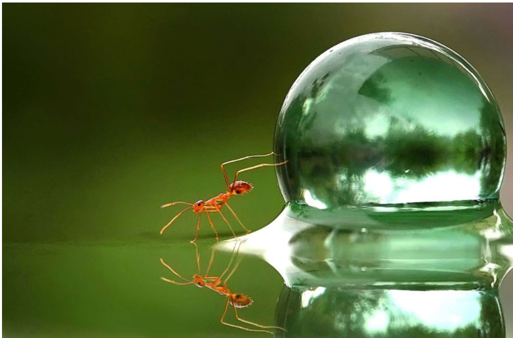
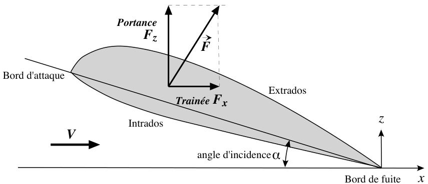
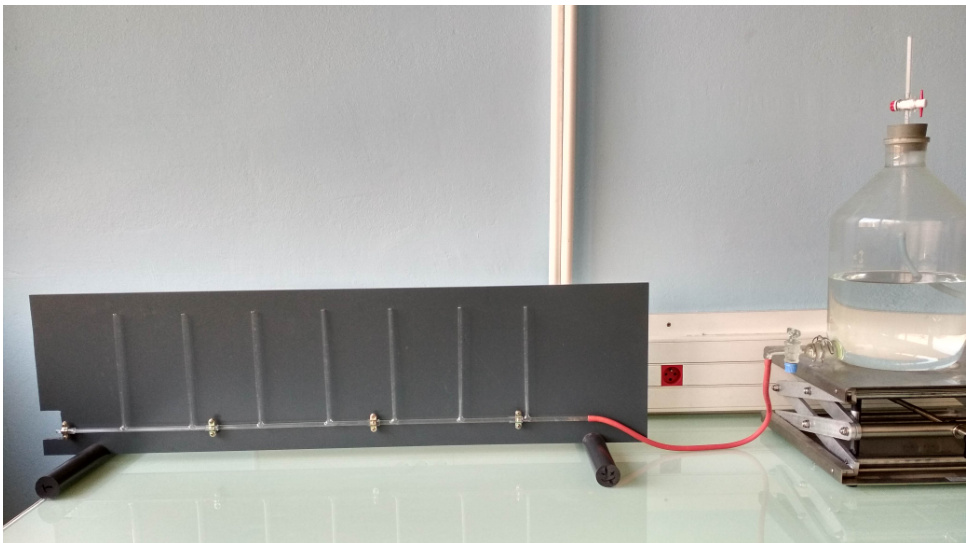
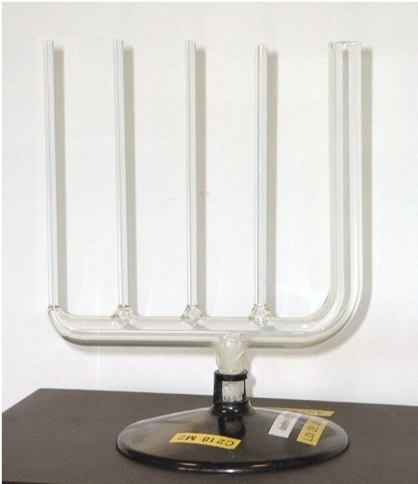
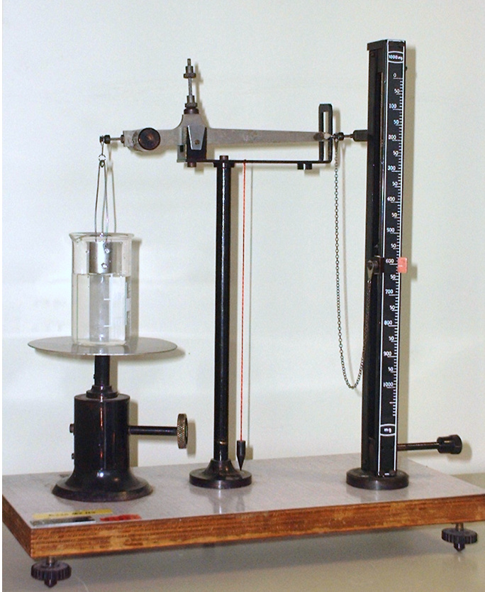
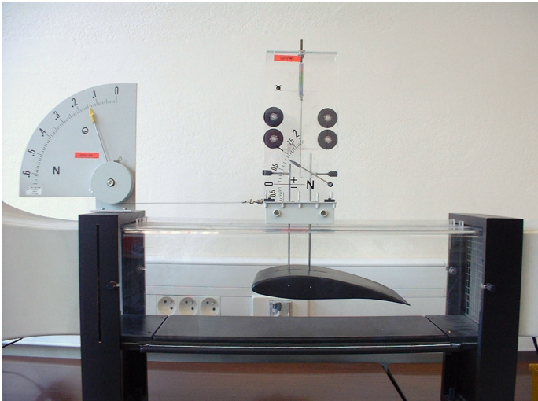

# Travaux pratiques Mécanique des fluides  

# MMC  

(2ème semestre)  

  

# Travaux Pratiques de Mécanique des Fluides  

Ph. Devoulon, P. Spathis, M. Amara  

18 mars 2024  

Les TP se déroulent dans les salles C218-C219 du bâtiment C; leur durée limitée de 8h nécessite qu’ils soient parfaitement préparés, en particulier sur le plan théorique.  

La note de TP repose sur une note individuelle relative au "sérieux" de l’étudiant (préparation du TP, investissement pendant la séance. . .) et une note de compte-rendu fait en binôme.  

Les deux séances de 4h sont organisées en atelier : les binômes se succèdent sur un ensemble de postes expérimentaux. La durée des manipulations dépend des postes, de l’imagination et efficacité des étudiants. Il ne sera pas possible de tout faire, mais il faut surtout bien faire. Il faudra vous entendre et organiser pour cette circulation de poste en poste soit "harmonieuse". Le compterendu est une synthèse des manipulations effectuées.  

Pour le tracé des courbes, notamment, mais aussi la prise de notes, pensez à vous munir d’un ordinateur portable (au moins) par binôme.  

# 1 Aide mémoire de mécanique des fluides  

# 1.1 Statique des fluides  

Loi de Pascal (loi de l’hydrostatique) Evolution, à partir de la pression en surface $P_{0}$ , avec la profondeur $h$ de la pression hydrostatique $P$ d’un fluide incompressible, de masse volumique $\rho$ en équilibre dans le champ de pesanteur d’accélération $g$ :  

$$
P=P_{0}+\rho g h
$$  

Loi de Jurin Elle décrit l’ascension capillaire d’une hauteur $h$ d’un fluide de tension superficielle $A$ mouillant le verre dans un tube de petit diamètre $d=2r$ (petit devant la longueur capillaire) :  

$$
h={\frac{2A\cos\theta}{\rho g r}}
$$  

$\theta$ est l’angle de mouillage du fluide avec le verre.  

Loi de Tate Elle relie la masse $m$ d’une goutte qui se détache d’un orifice de rayon $R$ , d’axe vertical, à la tension superficielle $A$ du fluide :  

$$
m={\frac{2\pi R A}{g}}
$$  

En pratique, on aura plutôt :  

$$
m={\frac{2\pi R k A}{g}}
$$  

où $k$ est un coefficient inférieur à 1, caractéristique de la géométrie de l’orifice.  

Formule de Laplace Surpression $\Delta P$ à l’intérieur d’une goutte sphérique de rayon $R$ :  

$$
\Delta P={\frac{2A}{R}}
$$  

$A$ est la tension de surface associée à l’interface. Dans le cas d’une bulle de savon, on a :  

$$
\Delta P={\frac{4A}{R}}
$$  

en raison de la présence de deux interfaces.  

# 1.2 Dynamique des fluides  

# 1.2.1 Fluide parfait  

Loi de Bernoulli : Un fluide parfait (incompressible, non visqueux), en écoulement permanent, conserve sa densité d’énergie mécanique $B$ le long d’une ligne de courant :  

$$
B={\frac{1}{2}}\rho\nu^{2}+\rho g z+P
$$  

# 1.2.2 Fluide visqueux  

Force de viscosité un élément de surface $S$ , parallèle (direction $O x$ ) à un écoulement laminaire d’un fluide de viscosité dynamique $\eta$ , de vitesse variable perpendiculairement à S (direction Oz) subit une force selon $O x$ :  

$$
F_{\nu_{x}}=\eta S\frac{\partial\nu_{x}}{\partial z}
$$  

Viscosité cinématique :  

$$
\nu={\frac{\eta}{\rho}}
$$  

Loi de Poiseuille Débit $D$ d’un fluide de viscosité $\eta$ dans une canalisation de section circulaire (rayon $r$ ), présentant une variation de charge $\Delta P$ ( $\mathrm{\check{\rho}}=$ pression à l’horizontale) sur une longueur $L$ , en considérant un régime laminaire à profil de vitesse parabolique :  

$$
D=\frac{\pi r^{4}}{8\eta}\frac{\Delta P}{L}
$$  

Formule de Stokes Force de résistance au mouvement d’une sphère de rayon $R$ plongée dans un fluide de viscosité $\eta$ et de vitesse $\vec{\nu}$ par rapport au fluide au repos :  

$$
{\vec{F}}=-6\pi\eta R{\vec{\nu}}
$$  

Nombre de Reynolds Nombre $R_{e}$ sans dimension traduisant l’importance relative des effets d’inertie et de viscosité dans un écoulement de vitesse et longueur caractéristiques respectives $\nu$ et $L$ :  

$$
R_{e}=\frac{\rho\nu L}{\eta}=\frac{\nu L}{\nu}
$$  

pour un tuyau cylindrique, quand $R_{e}>2000$ , on peut s’attendre au développement d’un régime turbulent. A l’inverse, un écoulement avec $R_{e}$ faible se produit en régime laminaire. Le nombre de Reynolds doit être systématiquement calculé pour tous les écoulements étudiés.  

  
FIGURE 1 – Schéma d’un profil d’aile montrant les définitions utiles.  

Nombre de Froude Nombre $F_{r}$ sans dimension traduisant l’importance relative des effets d’inertie et de pesanteur dans un fluide, pour un écoulement de vitesse $\nu$ et hauteur caractéristique $h$ :  

$$
F_{r}=\frac{\nu}{\sqrt{g h}}
$$  

# 1.3 Forces aérodynamiques  

Coefficients de résistance aérodynamique : Pour un objet se déplaçant dans un fluide de masse volumique $\rho$ à une vitesse $\nu$ trop grande pour permettre un régime laminaire, il y a formation d’un sillage et la résistance à l’avancement devient proportionnelle à la pression d’arrêt :  

$$
P_{a}={\frac{1}{2}}\rho\nu^{2}
$$  

Pour un objet de surface frontale S (appelée maître couple), on introduit les coefficients aérodynamiques $C_{x},C_{y}$ et $C_{z}$ . La résultante aérodynamique $F_{\mu}$ selon la direction $\mu_{\sf}(\mu=,x,y\sf_{}0u_{}z)$ s’exprime comme :  

$$
F_{\mu}=C_{\mu}S P_{a}=\frac{1}{2}\rho\nu^{2}S C_{\mu}
$$  

Par convention, l’axe $x$ est celui de la vitesse relative objet-fluide tandis que $z$ est selon la verticale. Attention : dans le cas de l’aile d’avion (Figure 1), d’incidence variable $\alpha$ , la surface du maître couple S est remplacée par la surface ailaire, soit la surface présentée par l’aile perpendiculairement à sa corde et son envergure.  

# 2 Travail Préparatoire  

# Tension superficielle  

Établir les lois de Laplace, de Jurin, de Tate, ainsi que les relations de la méthode d’arrachement.  

# Loi de Poiseuille  

Démontrer qu’en régime permanent le profil de vitesse est parabolique dans le tuyau. En déduire la relation entre la perte de charge et le débit.  

# Seuil en V  

Un seuil en V, c’est-à-dire une cloison de retenue présentant une ouverture en V, par laquelle s’écoule de l’eau depuis un grand réservoir, permet une mesure de débit en relevant la hauteur d’eau $h$ au dessus de la pointe du V. En utilisant la loi de Bernoulli pour des lignes de courant d’altitude variable $z$ et introduisant l’angle d’ouverture $\alpha$ de la pointe du V (symétrique), établir la relation entre le débit volumique $Q$ et la hauteur $h$ . On pourra recourir à une intégration par parties.  

# Tube de Pitot  

En utilisant la loi de Bernoulli, retrouver que le carré de la vitesse d’un fluide est proportionnel à la différence de pression entre deux entrées d’un tube (de Pitot), l’une ouverte face à l’écoulement et l’autre perpendiculairement.  

# 3 Manipulations proposées  

Selon la disponibilité des matériel et votre imagination, vous procéderez à une série d’expé- riences relevant des thèmes ci-après. Une brève présentation sera effectuée en séance par l’enseignant.  

# 3.1 Caractéristiques d’un fluide  

Vous avez à disposition plusieurs fluides, typiquement : eau distillée, alcool éthylique, glycérol.  

# 3.1.1 Densité  

Pour les fluides disponibles, mesurer leur densité avec le matériel disponible.   
— Au moyen d’un manomètre et de tuyaux, vérifiez la loi de Pascal (loi de l’hydrostatique).   
— Utilisez un densitomètre (Archimède).  

# 3.1.2 Viscosité  

On réalise un écoulement de Poiseuille dans un tube en verre alimenté par un réservoir d’eau de type vase de Mariotte (Cf. Figure 2). Le tube doit être parfaitement horizontal pour ne pas rajouter un terme d’énergie potentielle à l’écoulement  

— Quel est l’intérêt du vase de Mariotte?   
— Comment mesurer le débit, la vitesse?   
— Calculer le nombre de Reynolds et discuter du type d’écoulement. Eventuellement, ajuster la hauteur du vase de Mariotte.   
— Mesurer le débit (avec une bonne précision) et les hauteurs d’eau dans les dérivations. — Par un tracé approprié, en déduire la viscosité de l’eau.  

# 3.1.3 Tension superficielle  

Loi de Jurin On utilise un "chandelier" constitué d’une série de tubes capillaires de diamètres différents et reliés à un même réservoir (Figure 3). Le remplissage est délicat et un nettoyage préalable au vinaigre est souvent nécessaire. Manipuler le dispositif avec précaution car il est très fragile !  

  

FIGURE 2 – Vase de Mariotte et conduit horizontal muni de tube verticaux pour étudier les pertes de charges dans un écoulement visqueux.  

  
FIGURE 3 – Série de capillaires ("chandelier") pour étude de la loi de Jurin.  

  

FIGURE 4 – Balance à chaînette pour mesure de tension superficielle par la technique de l’arrachement. C’est le dispositif mécanique ancien, mais efficace. Un autre poste "moderne" est équipé d’une balance numérique.  

— Mesurer l’ascension $h$ du liquide dans la série de tubes capillaires par rapport à la hauteur de référence du plus gros diamètre (où l’ascension est négligeable).   
— Vérifier si la hauteur $h$ d’ascension obéit à la loi de Jurin et, le cas échéant, en déduire une valeur pour $A\cos\theta$ , $A$ étant la tension superficielle de l’eau et θ l’angle de mouillage.  

Tensiomètres à arrachement On dispose de tensiomètres à arrachement, de type à anneau de du Noüy ou à plaque de Wilhelmy, où la force exercée pour extraire un solide mouillé du liquide est mesurée par une balance (la Figure 4 montre une balance à chaînette). Bien nettoyer et rincer à l’eau distillée et/ou à l’alcool les différents éléments avant toute mesure.  

— Remplir le bécher du liquide choisi et l’installer sur le plateau mobile.   
— Suspendre l’anneau ou la plaque au support de la balance et tarer celle-ci.   
— Immerger l’anneau, le cylindre ou la plaque la plaque qui doivent être parfaitement mouillés.   
— Descendre progressivement et très doucement le plateau supportant le bécher en relevant l’indication de la balance en fonction (si possible) de la hauteur du plateau.   
— Procéder ainsi jusqu’à l’arrachement et en déduire une mesure de la tension superficielle du liquide.   
— Si vous utilisez l’installation à balance et repérage numérique de la position verticale $z$ du bécher, vous pouvez déterminer l’évolution de la force exercée sur le cylindre par le fluide ne fonction de z. A modéliser ensuite...  

Stalagmomètrie On utilise une seringue associée à une série d’embouts (aiguilles émoussées) de diamètres différents et une balance de précision.  

— Remplir la seringue avec le liquide choisi. Placer un récipient léger sur le plateau de la balance pour réceptionner les gouttes. Tarer la balance et en retirer le récipient. Pour chacun des diamètres disponibles :   
— le mesurer au pied à coulisse (sans l’écraser)   
— déterminer la masse d’un ensemble de $N$ gouttes formées avec précaution au bout de l’aiguille tenue verticalement au dessus du récipient. $N$ doit être suffisamment grand pour minimiser l’incertitude.   
— produire ensuite un graphe pour, éventuellement, retrouver la loi de Tate.   
— à partir d’une valeur de référence de tension superficielle pour l’eau, déterminer le facteur $k$ des embouts utilisés (en supposant qu’il est commun à la série). En déduire la tension superficielle d’un autre fluide.  

Autres effets On se contentera d’observations qualitatives.  

— Examiner la formation de surfaces minimales avec des cadres métalliques et de l’eau savonneuse.   
— Placer un liquide coloré dans un dièdre transparent. Vérifier qualitativement que la hauteur d’ascension est inversement proportionnelle à la distance à l’arête du dièdre.  

# 3.1.4 Viscosité & tension de surface  

En complément de la loi de Jurin, cette expérience consiste à caractériser la dynamique de l’ascension capillaire du fluide dans le tube.  

— A l’aide d’un appareil photo permettant l’enregistrement de vidéos, filmer l’ascension du liquide.   
— Utiliser tracker (https ://physlets.org/tracker/) pour extraire la position de l’interface liquidegaz en fonction du temps.   
— Déterminer si la dépendance suit l’équation de Lucas-Washburn $(L(t)=\sqrt{A\mathrm{cos}\theta r t/2\eta})$ et en déduire le rapport $\boldsymbol{A}\cos\theta/\eta$ .  

# 3.2 Écoulement des fluides  

# 3.2.1 Aérodynamique  

On dispose de trois souffleries, l’une ouverte et les deux autres à tunnel. Plusieurs types d’ané- momètres (notamment à fil chaud), ainsi que des manomètre différentiels sont disponibles.  

Soufflerie ouverte Cette soufflerie peut-être munie d’embouts différents, dont un tube de venturi (Figure 5). Elle peut-être installée pour souffler à la verticale ou à l’horizontale. Le débit d’air est ajustable.  

— Placer une balle de polystyrène expansé au dessus de la soufflerie en mode vertical. Faites varier le débit, inclinez la soufflerie... expliquez vos observations.   
— Etude d’un tube de Pitot $:$ pour différentes valeurs de la vitesse de l’air $\nu$ , mesurées à l’ané- momètre à fil chaud, mesurer au moyen d’un manomètre différentiel la différence de pression $\Delta P$ entre la prise dynamique (frontale) et celle statique (latérale) du tube de Pitot. Vé- rifier la proportionnalité entre $\Delta P$ et $\nu^{2}$ et en déduire une mesure de la masse volumique de l’air.   
— Tube de Venturi : A débit d’air constant, on utilise un tube de Venturi pour mesurer la diffé- rence de pression entre des sections différentes du tube. Exploiter les mesures et expliquer les différences existant entre zone de rétrécissement et zone d’élargissement.   
— Aile d’avion : Celle-ci est perforée en une série de points sur l’intrados et extrados (plus un au bord d’attaque) qui, par des embouts, permettent des mesures de pression différentielle. Retrouver ainsi le phénomène de portance. Incliner l’aile pour visualiser le décrochage à l’aide du fil de laine fixé sur l’extrados de l’aile.  

  
FIGURE 5 – Tube de Venturi installé sur la soufflerie à conduit ouvert.  

Soufflerie fermée La vitesse de l’écoulement est ajustable. Les vitesses d’écoulement seront mesurées à l’anémomètre à fil chaud. Plusieurs formes peuvent être placées dans le tunnel, des dynamomètres permettant de mesurer les résultantes de trainée/portance.  

— Estimer le nombre de Reynolds de l’écoulement pour une forme donnée.   
— Vérifier que la traînée est proportionnelle à la vitesse au carré.   
— Mesurer le $C_{x}$ pour différentes formes.  

La portance et la traînée d’une aile d’avion sera caractérisée en fonction de son inclinaison dans la soufflerie :  

— Mesurer la traînée $F_{x}$ et la portance $F_{z}$ de l’aile pour une série de valeurs de l’angle $\alpha$ d’incidence.   
— En déduire la série des $C_{x}$ et $C_{z}$ , tels que définis pour une aile.   
— Tracer le graphe caractéristique (polaire) de l’aile.   
— Quelle est la finesse maximale de celle-ci ?   
— Le décrochage est-il observable?  

# 3.2.2 Ecoulement à surface libre  

Le canal horizontal permet l’observation en régime stationnaire de l’écoulement d’eau en pré- sence de différents types d’obstacles et le passage régime fluvial - régime torrentiel associé. Les grandeurs qui peuvent être mesurées sont :  

— le débit via un débitmètre qui renvoie 752 impulsions par litre. le débit peut être modifié en agissant sur le Variac (transformateur homopolaire) d’alimentation de la pompe.  

  

FIGURE 6 – Soufflerie à tunnel avec un profil d’aile installé. Si disponible, on préférera le dispositif semblable, mesurant les forces grâce à des balances numériques.  

— la hauteur d’eau $h$ en un point particulier du canal.   
— On peut aussi mesurer directement la vitesse au niveau de la surface libre avec de petits objets flottants : attention ! il ne faut surtout rien abandonner dans l’eau qui puisse bloquer la turbine du débitmètre.  

Les obstacles disponibles sont :  

— un déversoir à lame mince en V (mesure du débit) une vanne à l’extrémité avale du canal (variation de la charge et du débit)   
— un "venturi" (analogue à la pile d’un pont)   
— un déversoir large (diminution de la charge et limitation du débit maximal) un seuil qui permet une observation et des mesures au niveau du ressaut hydraulique  

Attention, tout modification de l’écoulement par un obstacle modifie la charge en amont du canal, le débit et donc les conditions d’écoulement.  

Il faut systématiquement :  

— calculer le ou les nombres de Froude relatif à un écoulement.   
— observer l’ influence de la viscosité (perte de charge) et la couche limite (bord d’un obstacle par exemple).  

Étude des pertes de charges On mesure la hauteur d’eau à différents intervalles le long du canal, ainsi que le débit. On peut ainsi faire un bilan énergétique et en déduire les pertes par unité de longueur $\left(\mathrm{W}/\mathrm{m}\right)$ lors de l’écoulement. Pour les différents obstacles et pour le ressaut hydraulique, on peut faire de même et estimer les pertes énergétiques engendrées par ceux-ci.  

Influence de divers obstacles Étudier l’influence du venturi, du déversoir large, de la vanne.  

Seuil et ressaut hydraulique Régler le débit en fermant partiellement la vanne à l’extrémité du canal de manière à observer le ressaut hydraulique derrière le seuil (mieux que le venturi ?) et mesurer les différentes hauteurs d’eau.  

Déversoir à lame mince en V - étalonnage du débit Mesurer pour différents débits $Q$ la hauteur $^d$ de la lame d’eau. Par un graphe approprié, vérifier si la relation théorique entre $Q$ et $^d$ est vérifiée.  

# Ouvrages de références  

L’ouvrage [1] est un excellent point de départ pour les problèmes de capillarité. [2] est un ouvrage de référence. Enfin [8] est plus spécialisé.  

[1] P-G. De Gennes, F. Brochard-wyart, D. Quéré, Belin Gouttes, bulles, perles et ondes, (Belin, 2005).   
[2] E. Guyon, J.-P. Hulin, L. Petit, Hydrodynamique physique, (EDP Sciences, 2012).   
[3] Quaranta, Dictionnaire de Physique Expérimentale, Tome 1 La mécanique, (Pierron, 2002).   
[4] R. Comolet, Mécanique expérimentale des fluides, Tome 1 : Statique et dynamique des fluides non visqueux, (Dunod Sciences-Sup, 2002).   
[5] J.-M. Brébec et al., Mécanique des fluides, (Hachette supérieur).   
[6] J.-P. Pérez, Mécanique, (Masson sciences, 2014).   
[7] P. Fleury et J.-P. Mathieu, Mécanique Physique, (Eyrolles, 1953)   
[8] Landau, Lifchitz, Physique théorique - Mécanique des fluides, (Ellipses)  