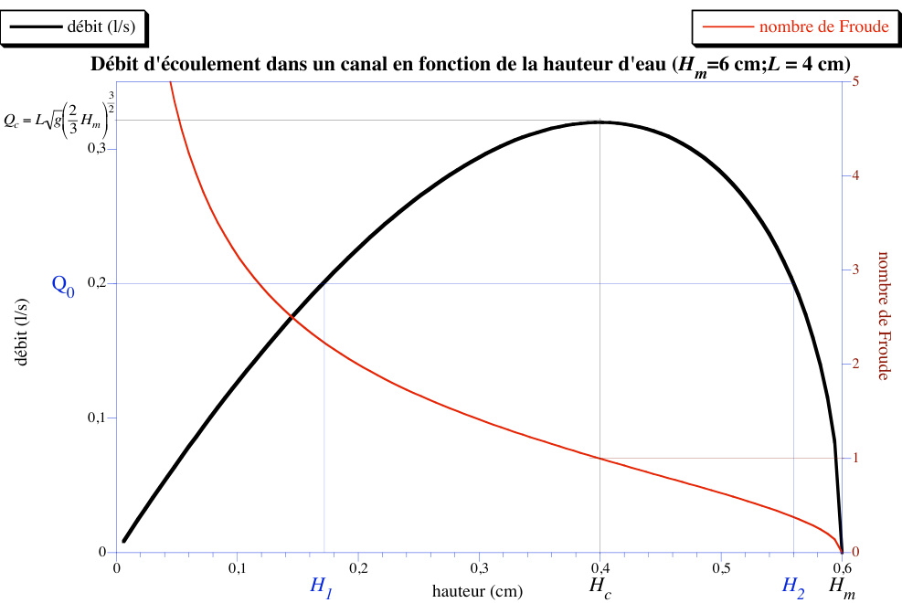
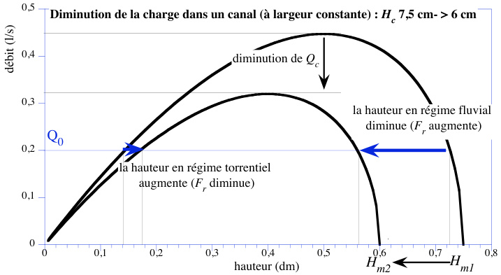
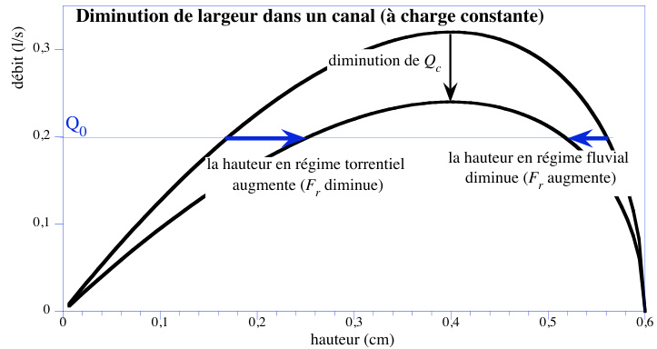
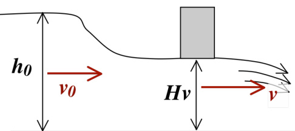
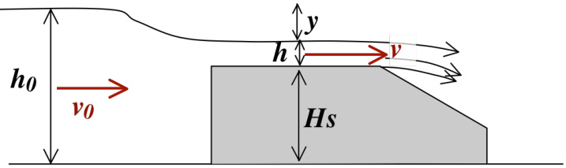
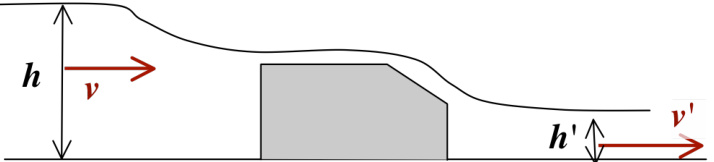
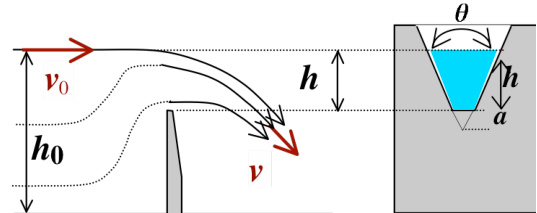
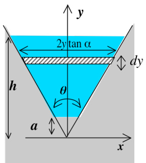
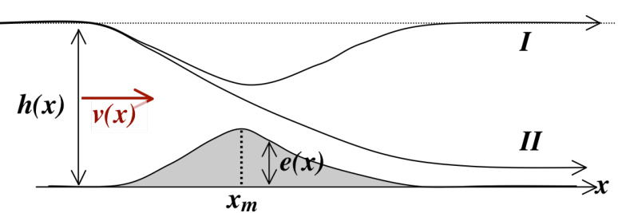
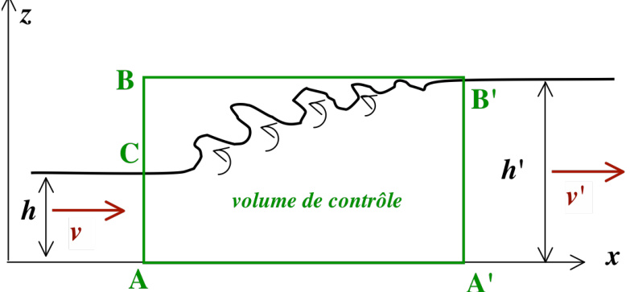

# Bases d'hydraulique  

# I- Écoulement stationnaire dans un canal horizontal à fond plat  

# 1- Hypothèses et expressions  

On suppose le fluide parfait, l'écoulement laminaire et irrotationnel. On peut appliquer le théorème de Bernoulli à une ligne de courant avec une constante identique dans tout le fluide : $P+{\frac{1}{2}}\uprho\nu^{2}+\uprho g h=K$ hypothèse $\therefore$ la vitesse $\nu$ du fluide est la même dans toute section droite du canal.  

Pour une hauteur d'eau $h$ , et une largeur du canal $L$ , le débit volumique est : $\left|Q=L h\nu\right|$ Pour une ligne de courant au niveau de la surface libre $(P=P_{0}):\boxed{h+\frac{\nu^{2}}{2g}=H_{m}}$  

où $H_{m}$ est la hauteur maximale d'eau possible ; plus précisément, il s'a!g it de la charge totale de l'écoulement due aux conditions en amont de l'écoulement : ce peut être par exemple la hauteur d'eau d'un plan d'eau qui alimente le canal. Elle est influencé par le débit d'une source, la présence d'un déversoir ou d'une vanne etc… $H_{m}$ peut varier au cours de l'écoulement à cause de pertes (notamment turbulence du fluide visqueux…) $\begin{array}{r l r}{\implies}&{{}\boxed{\nu=\sqrt{2g(H_{m}-h)}}\qquad}&{\boxed{Q=L h\sqrt{2g(H_{m}-h)}}}\end{array}$  

# 2- Étude de $\pmb{\mathscr{o}}$ en fonction de h (pour $\underline{{H}}_{\underline{{m}}}.$ constant) à largeur L constante  

$\frac{d Q}{d h}=L \sqrt{2 g}\left(\sqrt{H_m-h}-\frac{h}{2 \sqrt{H_m-h}}\right)=0 \quad \Rightarrow \quad$ extremum pour

$H_c=\frac{2}{3} H_m$

 avec $\underline{Q}_c=L \sqrt{g}\left(\frac{2}{3} H_m\right)^{\frac{3}{2}}$

Nombre de Froude : $F_r=\frac{v}{\sqrt{g h}}$

Pour le canal, on peut écrire :

$F_r=\frac{Q}{L \sqrt{g} h \sqrt{h}}=\sqrt{2\left(\frac{H_m}{h}-1\right)}=\sqrt{\frac{3 H_c}{h}-2} \Rightarrow \quad h>H_c \Leftrightarrow F_r>1$

  

# Conclusion  

A largeur $L$ et charge totale $H_{m}$ fixées, un canal ne peut évacuer qu'un débit maximal $Q_{c}=L\sqrt{g}(\frac{2}{3}H_{m})^{3}/2$ Pour un débit fixé $Q_{0}<Q_{c}$ , il existe deux régimes d'écoulement possibles :  

• $h=h_{1}<H_{C};$ : faible hauteur, grande vitesse, nombre de Froude supérieur à 1 : régime torrentiel • $h=h_{2}>H_{C}{:}$ grande hauteur, faible vitesse, nombre de Froude inférieur à 1 : régime fluvial  

# 3- Énergie et écoulement  

densité volumique d'énergie moyenne sur une section du canal :   
$\left\langle e\right\rangle^{S}=\frac{1}{L h}\int_{0}^{h}\left(\frac{1}{2}\uprho\nu^{2}+\uprho g z\right)L d z=\frac{1}{2}\uprho\nu^{2}+\frac{1}{2}\uprho g h\qquad\Rightarrow\qquad\left\langle\zeta e\right\rangle^{S}=\frac{1}{2}\uprho(\nu^{2}+g h)\Biggr\}$   
L'énergie est majoritairement sous forme cinétique en régime torrentiel $(F_{r}>1)$ , et sous forme potentielle en régime fluvial $(F_{r}<1)$ .   
On peut s'écrire à partir de $h+\frac{\nu^{2}}{2g}=H_{m}\qquad\Rightarrow\qquad\left\langle e\right\rangle^{S}=\uprho g(H_{m}-h)$   
Puissance transportée (flux d'énergie à travers une section) $(W a t t):I=\iint_{\sec\tan}(\frac{1}{2}\uprho\upnu^{2}+\uprho g z)\upnu d S$   
$I=\frac{1}{2}\uprho\nu^{3}L h+\frac{1}{2}\uprho g\nu L h^{2}=\frac{1}{2}\uprho(\nu^{2}+g h)Q:$   
En fonction du nombre de Froude : $I=\frac{1}{2}\uprho g h({F_{r}}^{2}+1)Q=\frac{1}{2}\uprho\nu^{2}(1+\frac{1}{{F_{r}}^{2}})Q$  

# 4- Variation de la charge totale  

Conséquences (voir graphe) : si la charge diminue, le débit maximal $Q_{c}$ diminue. Dans un canal à fond plat horizontal, pour un débit fixé $Q_{0}$ en écoulement fluvial, les pertes (visqueux…) au cours de l'écoulement diminue la charge $H_{m}$ et donc la hauteur d'eau diminue (graphe), la vitesse augmente( $Q_{0}=L h\nu$ ) et le nombre de Froude augmente $(F_{r}=\frac{Q_{0}}{L\sqrt{g}h^{5/2}})$  

$\rightarrow$ peut être observé expérimentalement le long du canal en l'absence d'obstacle.  

  

# II - Ouvrages divers  

# 1- Obstacle de type Venturi  

exemples : passage par les piles d'un pont.  

En cas de variation locale de la largeur $L$ (pas trop brutale ${\frac{d L}{d x}}<<1...)$ , $Q_{c}$ varie. pour un rétrécissement, le régime fluvial passe $\grave{\mathrm{a}}$ un nombre de Froude plus élevé (la hauteur diminue) et inversement pour le régime torrentiel.  

  

# 2- Vanne  

  

Bernoulli : $Q=L H_{\nu}\sqrt{2g(H_{m}-H_{\nu})}$ Le débit est fixé par la hauteur sous la vanne et la charge.  

# 3- Déversoir large de hauteur HS  

  

# Analyse  

Largeur identique avant et au niveau du déversoir.  

${\mathrm{Bernoulli:~}}h_{0}+{\frac{\nu_{0}^{2}}{2g}}=H_{m}=(H_{s}+h)+{\frac{\nu^{2}}{2g}}\qquad\Rightarrow\qquad\nu={\sqrt{2g(H_{m}-H_{s}-h)}}={\sqrt{2g y+\nu_{0}^{2}}}$ L'étude est donc la même que précédemment mais en prenant à la place de $H_{m}$ la valeur $H_{m}{-}H_{s}$ !  

Un déversoir permet de diminuer la charge ! $H_{m}^{\prime}=H_{m}-H_{s}$ donc le débit maximal.  

# Mesure du débit  

Supposons que l'on observe de part et d'autre d'un obstacle des hauteurs $h$ et $h^{\prime}$ , l'écoulement restant laminaire pour pouvoir appliquer Bernoulli.  

  

2gh+v²=2gh+v2etQ²=²h²（v²+2gh-n)=²h²v²v²=2gh²h-）=2gh²   
On déduit donc le débit des hauteurs observées : $Q=L h h^{\prime}\sqrt{\frac{2g}{h+h^{\prime}}}$   
De mme pourles nmbres d Foude -() $F_{r}F_{r}^{\prime}=\frac{\sqrt{h h^{\prime}}}{h+h^{\prime}}$   
En pratique, l'obstacle crée des turbulences (dissipation pour le fluide réel) et Bernoulli n'est pas applicable  

# 4- Déversoir à lame mince en V  

  

Bernoulli : $\nu(y)=\sqrt{2g(h-y)}$   
débit : $d Q=\nu(y)2y$ tan"dy $=2{\sqrt{2g}}$ tan" h # y ydy   
$\begin{array}{l}{{\displaystyle\Rightarrow\:Q=2\sqrt{2g}\tan\alpha\displaystyle\int\sqrt{h-y}y d y\mathrm{~avec~}\displaystyle\int_{a}^{h}\sqrt{h-y}y d y=\left[-\frac23(h-y)^{3/2}y\right]_{a}^{h}+\displaystyle\int\frac13(h-y)^{3/2}d y}}\ {{\displaystyle\left[-\frac23(h-y)^{3/2}y\right]_{a}^{h}=\frac23(h-a)^{3/2}\mathrm{~et}\displaystyle\int_{a}^{h}\frac23(h-y)^{3/2}d y=-\frac4{15}\left[(h-y)^{5/2}\right]_{a}^{h}=\frac4{15}(h-a)^{5/2}}}\ {{\displaystyle\mathrm{Au~final:}\quad Q=\frac{8\sqrt{2}}{15}\sqrt{g}\tan\alpha(h-a)^{3/2}(h+\frac32\alpha)}}\end{array},$  

  

En pratique, un déversoir de ce type permet de mesurer les débits des cours d'eau.  

# III!  - Annexe : vocabulaire  

Pression par rapport à une pression de référence : $P=P_{0}+\uprho g h$ Pour les hauteurs, la charge totale est $H_{m}=\frac{P}{\uprho g}+\frac{\upnu^{2}}{2g}$  

$\frac{P}{\uprho g}$ hauteur d'eau due à la pressi!o n $\frac{\nu^{2}}{2g}$ hauteur cinetique $\frac{P}{\uprho g}$ hauteur piézométrique $(o u~{\frac{P_{g}}{\uprho g}}={\frac{P_{0}}{\uprho g}}+h)$  

Pour les pressions P + "v2  

$\frac{\uprho\upnu^{2}}{2}$ est la pression dynamique $P+{\frac{\uprho\upnu^{2}}{2}}$ la pression totale ou de stagnation (en un point d'arrêt)  

# II- Seuil et ressaut hydraulique  

# Seuil  

  

débit : Q = v(x)h(x)L   
Bernou ${\mathit{I i}}:{\mathit{H}}_{m}=h(x)+e(x)+{\frac{\nu^{2}(x)}{2g}}\quad(\nu(x)={\sqrt{2g(H_{m}-h(x)+e(x))}})$   
Nombre de Froude : $F_{r}(x)=\frac{\nu}{\sqrt{g h}}$ dh dv dh de v dv   
derivation des deux premieres ⇒ v + h 0 0 dx dx dx dx g dx   
eliminationde $?~{\frac{d h}{d x}}=-{\frac{h}{\nu}}{\frac{d\nu}{d x}}~:\left[{\frac{d e}{d x}}={\frac{g h-\nu^{2}}{g h}}\times{\frac{d\nu}{d x}}\right]\mathrm{ou}\left[{\frac{d e}{d x}}={\frac{h}{\nu}}(1-F_{r}^{2}(x))\times{\frac{d\nu}{d x}}\right]\mathrm{ou}~;$  

Avant le seuil, on suppose $F_{r}<1$ .  

${\underline{{P r e m i}}}{\underline{{r e r e}}}p h a s e:{\underline{{d e}}}>0\Rightarrow{\underline{{d\nu}}}>0$ la vitesse croit, la hauteur décroît ; $F_{r}$ augmente.   
$\underline{{A r r i}}\nu\dot{e}e n x_{\underline{{m}}}(\frac{d e}{d x}(x_{{m}})=0)$ ${\underline{{1}}}^{\mathrm{er}}\cos:{\frac{d{\boldsymbol{\nu}}}{d x}}=0$ !e t ${\frac{d h}{d x}}=0\Rightarrow$ extremum de $\nu$ et de $h$ . La vitesse arrête d'augmenter et la hauteur de diminuer $2\underline{{\mathrm{nd}}}\cos:F_{r}=1$ avec toujours $\frac{d\nu}{d x}>0$ et $\frac{d h}{d x}<0$ .   
$S e c o n d e p h a s e:\frac{d e}{d x}<0$ 1 cas : les dérivées ! $\frac{d\nu}{d x}$ et $\frac{d h}{d x}$ changent de signe, $F_{r}$ restant toujours inférieur à 1. $\rightarrow$ on revient à l'état initial. 2nd cas : les dérivées $\frac{d\nu}{d x}$ et $\frac{d h}{d x}$ toujours de même signe font que $\nu$ continue à augm nombre de !F roude!  augmentant au delà de $1\rightarrow o n$ passe en régime torrentiel !  

remarque $:$ de manière symétrique, en partant d'un régime torrentiel, on aura le raisonnement inverse. Il n'est pas sur q!u e cela!  marche en pratique à cause du phénomène de ressaut ?  

# Ressaut hydraulique  

Il s'agit d'une zone turbulente permettant le passage du régime torrentiel au régime fluvial.  

  

On ne peut plus appliquer Bernoulli du fait du régime turbulent qui ne permet pas de suivre une ligne de courant.  

Avec le théorème sur la quantité de mouvement (équation bilan), on trouve (Guyon ou Pérez par exemple) :  

$$
\boxed{\nu^{\prime2}h^{\prime}-\nu^{2}h+\frac{1}{2}g(h^{\prime2}-h^{2})=0}
$$  

Débit : $\underline{{{\nu h}}}=\nu^{\prime}h^{\prime}$   
$\Rightarrow$ $\frac{\nu=\sqrt{\frac{h^{\prime}}{h}\frac{g(h+h^{\prime})}{2}}}{F_{r}=\sqrt{\frac{h^{\prime}(h+h^{\prime})}{2h^{2}}}}\operatorname{et}F_{r}^{\prime}=\sqrt{\frac{h(h+h^{\prime})}{2h^{\prime2}}}=\sqrt{\frac{h}{2}\frac{g(h+h^{\prime})}{2}}(>\sqrt{g h})$   
$\Rightarrow$  

# démonstration  

Turbulence : on ne peut suivre une ligne de courant !  

Pour un fluide parfait : " ##vt $\uprho\frac{\partial\vec{\nu}}{\partial t}+\uprho(\vec{\nu}\bullet\vec{\nabla})\vec{\nu}=-\vec{\nabla}P+\vec{f}^{e x t}$   
Pour la composante selon x : " ##vtx $x:\uprho\frac{\partial\nu_{_{x}}}{\partial t}+\uprho(\vec{\nu}\bullet\vec{\nabla})\nu_{_{x}}=-\frac{\partial P}{\partial x}+\vec{f}_{x}^{e x t}$   
$(\vec{\nu}\bullet\vec{\nabla})\nu_{x}=\mathrm{div}(\vec{\nu}\nu_{x})-\nu_{x}\mathrm{div}\vec{\nu}\Rightarrow$ pour un fluide incompressible : $\uprho(\vec{\nu}\bullet\vec{\nabla})\nu_{x}=\mathrm{div}(\uprho\vec{\nu}\nu_{x})$   
$\begin{array}{r l}{\Rightarrow}&{{}\displaystyle\frac{\partial\uprho\upnu_{x}}{\partial t}=-\arcsin(\uprho\overrightarrow{\upnu}\nu_{x})-\frac{\partial P}{\partial x}+\overrightarrow{f}_{x}^{e x t}}\end{array}$   
Intégration sur le volume de contrôle $^+$ théorèmes de la divergence et du gradient) : $\frac{d}{d t}\iiint\uprho\nu_{x}d V=\frac{d P_{x}}{d t}=-\pounds\rho\nu_{x}\vec{\nu}\bullet d\vec{S}-\pounds\rho\vec{e_{x}}\bullet d\vec{S}+F_{x}^{e x t}$  

Pour le volume de contrôle du ressaut, en régime stationnaire, on en déduit selon $x$ :  

$$
\begin{array}{c}{{\displaystyle{A^{!}B^{!}:\wp\nu^{\prime}{}^{2}h^{\prime}+P_{0}h^{\prime}+\frac{1}{2}\wp p h^{2}}}}\ {{{}}}\ {{\displaystyle{A C:-(\wp\nu^{2}h+P_{0}h+\frac{1}{2}\wp g h^{2})}}}\ {{{}}}\ {{\displaystyle{\cdot\left[\nu^{\prime2}h^{\prime}-\nu^{2}h+\frac{1}{2}g(h^{2}-h^{2})=0\right]}}}\end{array}\qquad\begin{array}{l}{{{}}}\ {{{\displaystyle B C:-P_{0}(h^{\prime}-h)}}}\ {{{}}}\ {{{}}}\end{array}
$$  

d'où il reste:  